# Animal and Cost Management Web Application

## Abstract

Animals are living beings, not toys, and keeping them is a responsibility. A responsible animal keeper must think about whether he really wants to keep an animal and whether he can accept the lifestyle changes and consequences that come with housing animals. People should be aware that some species of animals can live up to a decade or two. The Animal Act stipulates that the owner is obliged to take care of housing, feeding, supervising, keeping clean, and possible medical treatment of the animal.

In my thesis, I will create a system in which not only **data about animals can be recorded**, but also the **equipment**, **food**, **medicine** they need, as well as information about **medical visits**. This system also functions as a **cost accounting system**, in which **tracking expenses and stock quantities** is also possible.

With this system, I would like to make the work of animal keepers (wildlife parks, petting zoos, and possibly private individuals) easier in that they can easily look back on animal-related information and costs.

## Used Technologies

- Laravel
- Inertia
- Vue

## Presenting the Application

### Login Form
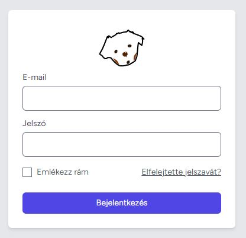

### Homepage (After Login)

### Users
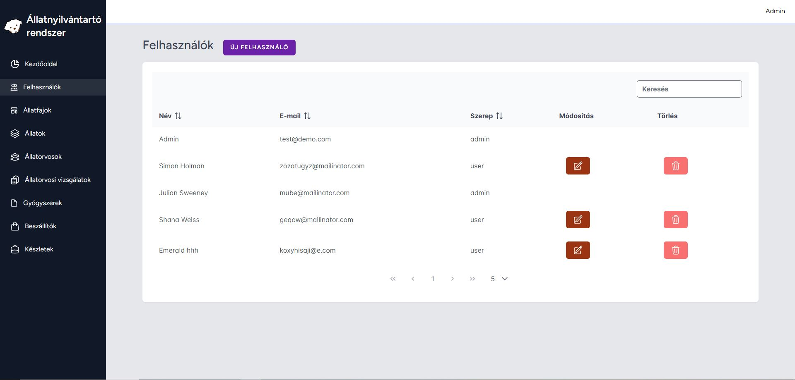

### Animal Species
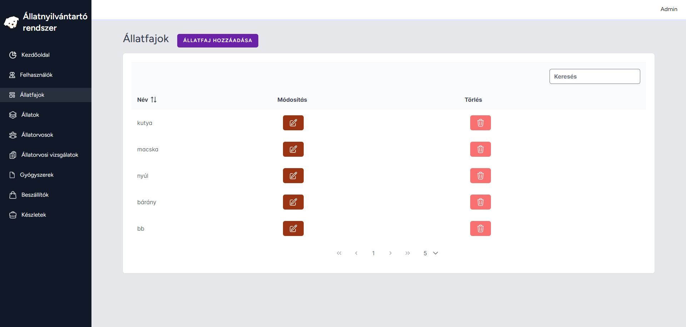

### Animals
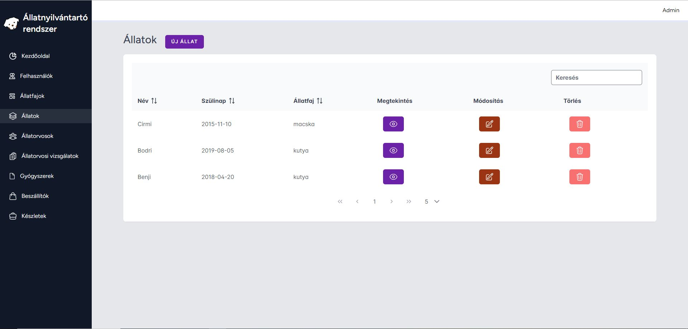

### Animal Detailed Page

#### Basic Information About the Animal
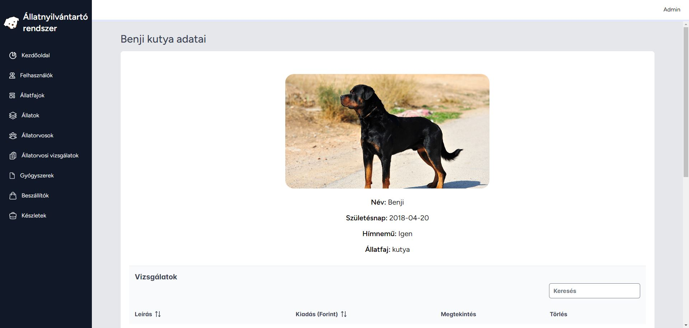

#### Veterinary Expenses and Inventory Information About the Animal
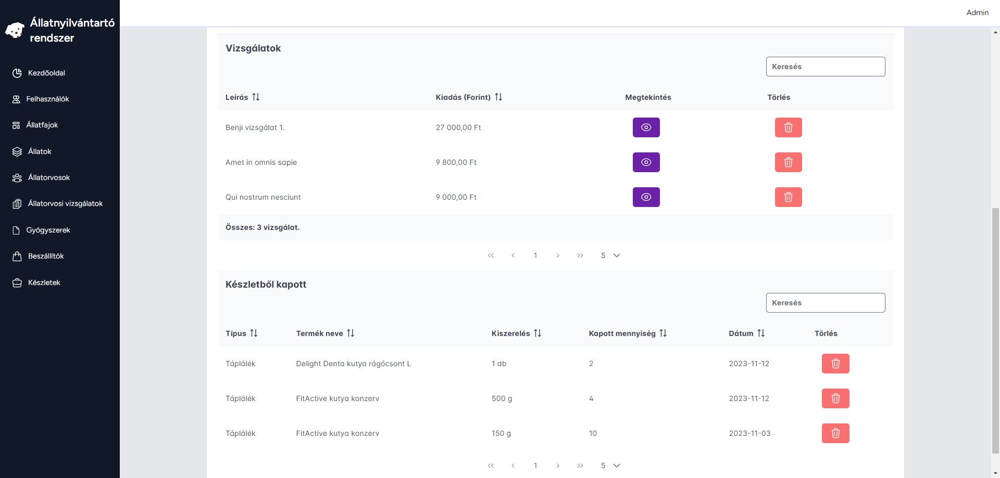

### Add New Animal
"Create" pages look like this: 

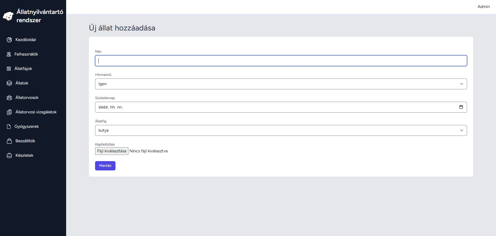

### Veterinarians
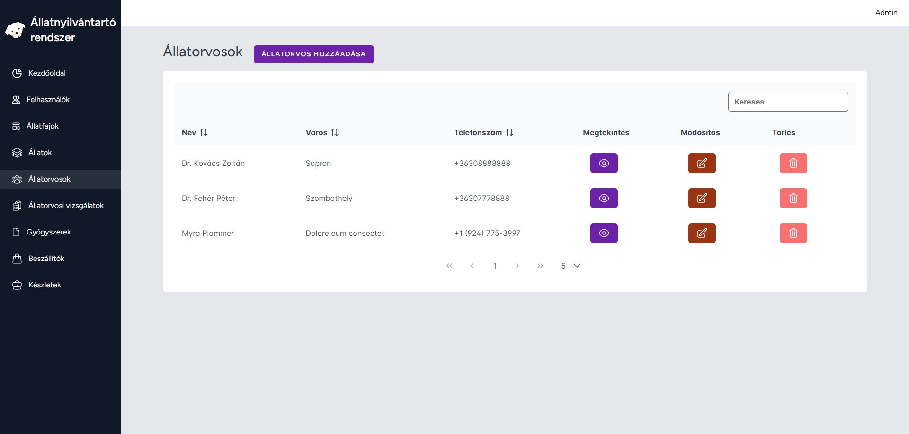

### Veterinarian Detailed Page
Examinations made by the veterinarian and their costs.

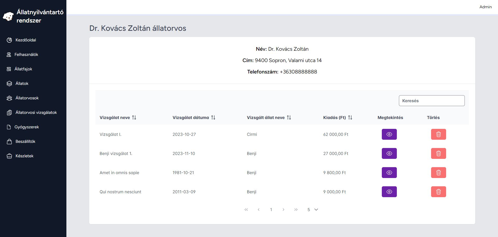

### Details of Veterinarian Examinations
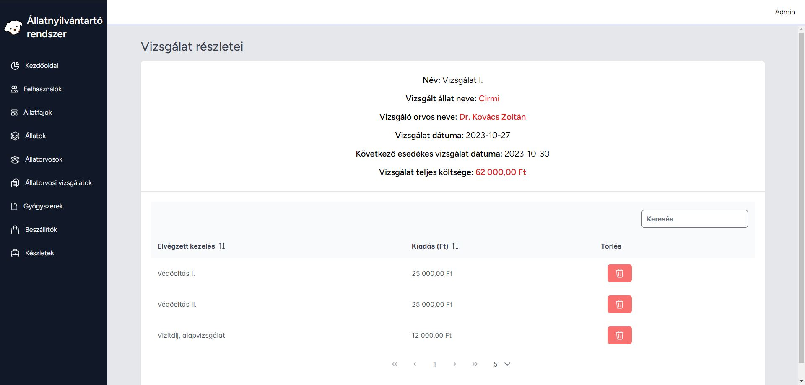

### Medicines
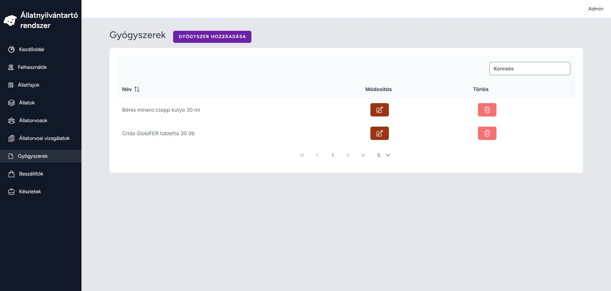

### Suppliers
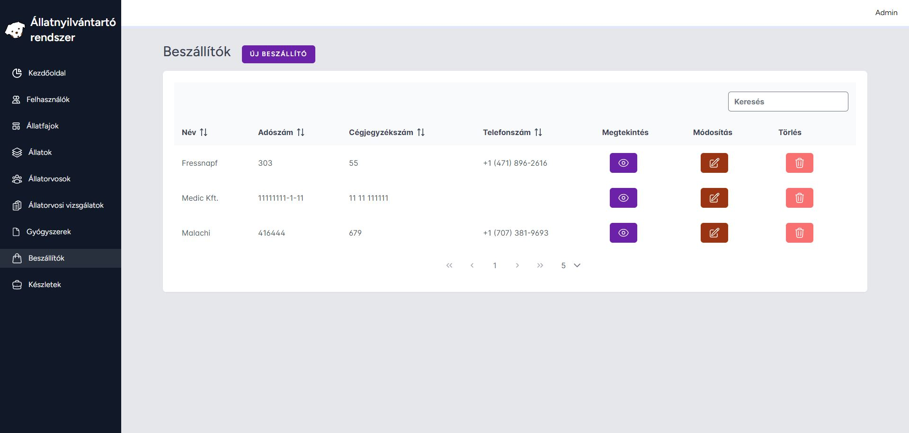

### Supplies
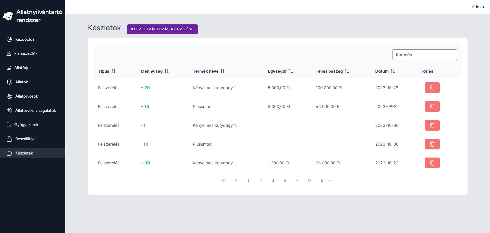
